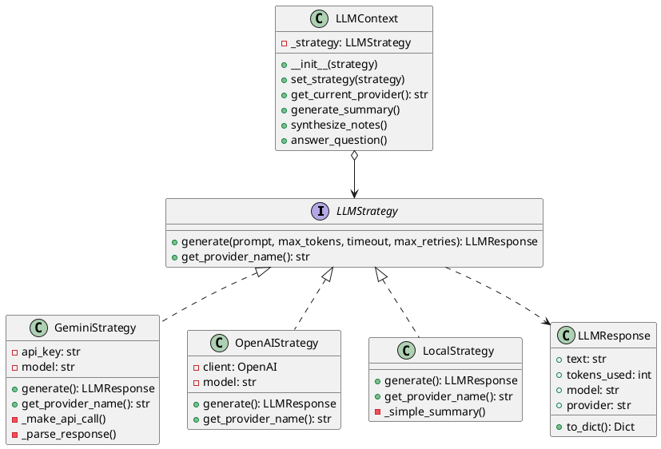

# UML Diagrams for Design Patterns

## Table of Contents
1. [Strategy Pattern - Class Diagram](#1-strategy-pattern---class-diagram)
2. [State Machine Pattern - State Diagram](#2-state-machine-pattern---state-diagram)
3. [Decorator Pattern - Component Diagram](#3-decorator-pattern---component-diagram)
4. [Overall System Architecture](#4-overall-system-architecture)

---

## 1. Strategy Pattern - Class Diagram

### Purpose
The Strategy pattern defines a family of algorithms (LLM providers), encapsulates each one, and makes them interchangeable.

### UML Class Diagram

```
┌─────────────────────────────────────────────────────────────┐
│                    <<interface>>                            │
│                    LLMStrategy                              │
├─────────────────────────────────────────────────────────────┤
│ + generate(prompt: str, max_tokens: int,                    │
│            timeout: int, max_retries: int): LLMResponse     │
│ + get_provider_name(): str                                  │
└────────────────────────▲────────────────────────────────────┘
                         │
                         │ implements
         ┌───────────────┼───────────────┬─────────────────┐
         │               │               │                 │
┌────────┴─────────┐ ┌──┴──────────┐ ┌──┴─────────────┐ ┌─┴────────────┐
│  GeminiStrategy  │ │OpenAIStrategy│ │ LocalStrategy  │ │FutureStrategy│
├──────────────────┤ ├──────────────┤ ├────────────────┤ ├──────────────┤
│- api_key: str    │ │- client: obj │ │                │ │   (Claude,   │
│- model: str      │ │- model: str  │ │                │ │   Cohere,    │
├──────────────────┤ ├──────────────┤ ├────────────────┤ │   etc.)      │
│+ generate()      │ │+ generate()  │ │+ generate()    │ │              │
│+ get_provider()  │ │+ get_provider│ │+ get_provider()│ │              │
│- _make_api_call()│ │              │ │- _extract_text()│              │
│- _parse_response()│ │             │ │- _simple_summary│              │
└──────────────────┘ └──────────────┘ └────────────────┘ └──────────────┘


        ┌────────────────── uses ──────────────────┐
        │                                          │
        ▼                                          │
┌────────────────────────────────────────────────────────┐
│                   LLMContext                           │
├────────────────────────────────────────────────────────┤
│ - _strategy: LLMStrategy                               │
│ - style_config: Dict                                   │
├────────────────────────────────────────────────────────┤
│ + __init__(strategy: Optional[LLMStrategy])            │
│ + set_strategy(strategy: LLMStrategy): void            │
│ + get_current_provider(): str                          │
│ + generate_summary(text, note_style, user_prompt):    │
│       Dict[str, Any]                                   │
│ + synthesize_notes(summaries, note_style,             │
│       user_prompt): Dict[str, Any]                     │
│ + answer_question(question, context_chunks):          │
│       Dict[str, Any]                                   │
│ - _select_strategy_from_config(): LLMStrategy          │
│ - _get_style_instructions(note_style): Dict            │
└────────────────────────────────────────────────────────┘
        │
        │ uses
        ▼
┌────────────────────────────────────────────────────────┐
│                   LLMResponse                          │
├────────────────────────────────────────────────────────┤
│ + text: str                                            │
│ + tokens_used: int                                     │
│ + model: str                                           │
│ + provider: str                                        │
├────────────────────────────────────────────────────────┤
│ + to_dict(): Dict[str, Any]                            │
└────────────────────────────────────────────────────────┘
```

### Relationships:
- **Interface:** `LLMStrategy` defines the contract
- **Concrete Strategies:** `GeminiStrategy`, `OpenAIStrategy`, `LocalStrategy` implement the interface
- **Context:** `LLMContext` uses a strategy and provides high-level methods
- **Data Class:** `LLMResponse` encapsulates the response

### Key Methods:
- `generate()`: Core algorithm - differs per strategy
- `get_provider_name()`: Returns provider identifier
- `set_strategy()`: Allows runtime strategy switching

---

## 2. State Machine Pattern - State Diagram

### Purpose
The State Machine pattern manages the file processing lifecycle, ensuring only valid state transitions occur.

### State Transition Diagram

```
                    ┌─────────────┐
                    │   UPLOADED  │ ◄── Initial State
                    └──────┬──────┘
                           │
                           │ start_processing()
                           │
                    ┌──────▼──────┐
                    │ PROCESSING  │ ◄── Extract text, chunk
                    └──────┬──────┘
                           │
                           │ finish_indexing()
                           │
                    ┌──────▼──────┐
                    │   INDEXED   │ ◄── Vectors stored in ChromaDB
                    └──────┬──────┘
                           │
                           │ start_summarizing()
                           │
                    ┌──────▼───────────┐
                    │  SUMMARIZING     │ ◄── Generate chunk summaries
                    └──────┬───────────┘
                           │
                           │ start_synthesizing()
                           │
                    ┌──────▼───────────┐
                    │  SYNTHESIZING    │ ◄── Combine into final note
                    └──────┬───────────┘
                           │
                           │ complete()
                           │
                    ┌──────▼──────┐
                    │  COMPLETED  │ ◄── Terminal State (Success)
                    └─────────────┘


                    ┌─────────────┐
                    │   FAILED    │ ◄── Terminal State (Error)
                    └─────▲───────┘
                          │
                          │ fail(error_message)
                          │
        ┌─────────────────┼─────────────────┐
        │                 │                 │
    (Any non-terminal state can transition to FAILED)


    Legend:
    ┌─────┐
    │State│  = Processing State
    └─────┘

    ──────►  = Valid Transition (with trigger name)

    Terminal States: COMPLETED, FAILED (no outgoing transitions)
```

### Valid Transitions Table:

| From State      | Trigger              | To State      | Condition         |
|----------------|----------------------|---------------|-------------------|
| UPLOADED       | start_processing()   | PROCESSING    | Always valid      |
| PROCESSING     | finish_indexing()    | INDEXED       | Chunks in ChromaDB|
| INDEXED        | start_summarizing()  | SUMMARIZING   | Chunks exist      |
| SUMMARIZING    | start_synthesizing() | SYNTHESIZING  | Summaries ready   |
| SYNTHESIZING   | complete()           | COMPLETED     | Note generated    |
| Any (non-term) | fail(error)          | FAILED        | Exception occurs  |
| FAILED         | retry()              | UPLOADED      | Manual retry      |

### State Machine Class Diagram

```
┌──────────────────────────────────────────────────────────┐
│            FileProcessingState (Enum)                    │
├──────────────────────────────────────────────────────────┤
│ + UPLOADED: str = "uploaded"                             │
│ + PROCESSING: str = "processing"                         │
│ + INDEXED: str = "indexed"                               │
│ + SUMMARIZING: str = "summarizing"                       │
│ + SYNTHESIZING: str = "synthesizing"                     │
│ + COMPLETED: str = "completed"                           │
│ + FAILED: str = "failed"                                 │
└──────────────────────────────────────────────────────────┘
                          │
                          │ uses
                          ▼
┌──────────────────────────────────────────────────────────┐
│              FileStateMachine                            │
├──────────────────────────────────────────────────────────┤
│ - file_id: str                                           │
│ - state: str                                             │
│ - machine: Machine                                       │
│ - update_callback: Callable                              │
│ - error_message: Optional[str]                           │
│ - state_history: List[Dict]                              │
├──────────────────────────────────────────────────────────┤
│ + __init__(file_id, update_callback, initial_state)     │
│                                                          │
│ # Transition triggers                                   │
│ + start_processing(): void                               │
│ + finish_indexing(): void                                │
│ + start_summarizing(): void                              │
│ + start_synthesizing(): void                             │
│ + complete(): void                                       │
│ + fail(error_message: str): void                         │
│ + retry(): void                                          │
│                                                          │
│ # Query methods                                         │
│ + get_current_state(): str                               │
│ + get_state_history(): List[Dict]                        │
│ + can_transition_to(trigger: str): bool                  │
│ + get_available_transitions(): List[str]                 │
│ + is_terminal_state(): bool                              │
│ + is_processing(): bool                                  │
│ + can_query(): bool                                      │
│ + can_get_notes(): bool                                  │
│                                                          │
│ # Internal                                              │
│ - _on_state_change(): void                               │
│ - _record_state_change(new_state): void                  │
└──────────────────────────────────────────────────────────┘
```

---

## 3. Decorator Pattern - Component Diagram

### Purpose
The Decorator pattern dynamically adds cross-cutting concerns (retry, timeout, rate limiting) to functions without modifying their core logic.

### Decorator Stack Diagram

```
┌──────────────────────────────────────────────────────────┐
│                  Original Function                       │
│                                                          │
│  def api_call():                                         │
│      return requests.get("https://api.com").json()      │
│                                                          │
└──────────────────────────────────────────────────────────┘
                          │
                          │ wraps
                          ▼
┌──────────────────────────────────────────────────────────┐
│         @with_rate_limit(calls_per_minute=10)            │
│                                                          │
│  ┌────────────────────────────────────────────────────┐ │
│  │  - Check if rate limit allows call                 │ │
│  │  - Wait if necessary (sliding window)              │ │
│  │  - Acquire permission                              │ │
│  │  - Call wrapped function                           │ │
│  └────────────────────────────────────────────────────┘ │
└────────────────────────┬─────────────────────────────────┘
                         │ wraps
                         ▼
┌──────────────────────────────────────────────────────────┐
│         @with_timeout(seconds=60)                        │
│                                                          │
│  ┌────────────────────────────────────────────────────┐ │
│  │  - Set alarm/timer for 60 seconds                  │ │
│  │  - Call wrapped function                           │ │
│  │  - Cancel alarm if completes                       │ │
│  │  - Raise TimeoutError if exceeds 60s               │ │
│  └────────────────────────────────────────────────────┘ │
└────────────────────────┬─────────────────────────────────┘
                         │ wraps
                         ▼
┌──────────────────────────────────────────────────────────┐
│    @retry_on_failure(max_attempts=3, backoff=2.0)       │
│                                                          │
│  ┌────────────────────────────────────────────────────┐ │
│  │  for attempt in range(1, 4):                       │ │
│  │      try:                                          │ │
│  │          return wrapped_function()                 │ │
│  │      except Exception as e:                        │ │
│  │          if attempt < 3:                           │ │
│  │              wait = 2.0 ** (attempt - 1)           │ │
│  │              sleep(wait)  # 1s, 2s                 │ │
│  │          else:                                     │ │
│  │              raise                                 │ │
│  └────────────────────────────────────────────────────┘ │
└────────────────────────┬─────────────────────────────────┘
                         │ finally calls
                         ▼
┌──────────────────────────────────────────────────────────┐
│                  Original Function                       │
│                  (Core Logic)                            │
└──────────────────────────────────────────────────────────┘
```

### Execution Flow (with all decorators):

```
1. Function called: api_call()
   ↓
2. Rate Limiter checks:
   - Has 10 calls been made in last 60 seconds?
   - If yes: Wait until window allows
   - If no: Proceed
   ↓
3. Timeout decorator sets 60-second timer
   ↓
4. Retry decorator tries (max 3 attempts):
   Attempt 1: Call original function
              ↓
              Exception? → Wait 1s, try again
              ↓
   Attempt 2: Call original function
              ↓
              Exception? → Wait 2s, try again
              ↓
   Attempt 3: Call original function
              ↓
              Success? → Return result
              Exception? → Raise to caller
   ↓
5. Timeout decorator cancels timer
   ↓
6. Rate limiter records successful call
   ↓
7. Result returned to caller
```

### Decorator Class Diagram

```
┌──────────────────────────────────────────────────────────┐
│              RateLimiter (Helper Class)                  │
├──────────────────────────────────────────────────────────┤
│ - calls_per_minute: int                                  │
│ - min_interval: float                                    │
│ - call_times: deque                                      │
│ - lock: Lock                                             │
├──────────────────────────────────────────────────────────┤
│ + __init__(calls_per_minute: int)                        │
│ + acquire(blocking: bool = True): bool                   │
└──────────────────────────────────────────────────────────┘


┌──────────────────────────────────────────────────────────┐
│           Decorator Functions (Module Level)             │
├──────────────────────────────────────────────────────────┤
│ + retry_on_failure(max_attempts, backoff_factor,        │
│       exceptions, on_retry): Decorator                   │
│                                                          │
│ + with_timeout(seconds): Decorator                       │
│                                                          │
│ + with_rate_limit(calls_per_minute): Decorator          │
│                                                          │
│ + with_exponential_backoff(initial_delay, max_delay,    │
│       factor): Decorator                                 │
│                                                          │
│ + with_resilience(max_attempts, timeout_seconds,        │
│       calls_per_minute): Decorator                       │
│       # Composite decorator combining all above          │
└──────────────────────────────────────────────────────────┘


┌──────────────────────────────────────────────────────────┐
│                Custom Exceptions                         │
├──────────────────────────────────────────────────────────┤
│ + TimeoutError: Exception                                │
│ + RateLimitExceeded: Exception                           │
└──────────────────────────────────────────────────────────┘
```

### Usage Examples:

```python
# Example 1: Single decorator
@retry_on_failure(max_attempts=3)
def simple_api_call():
    return requests.get("https://api.example.com").json()


# Example 2: Stacked decorators (order matters!)
@with_rate_limit(calls_per_minute=10)  # Outermost
@with_timeout(60)                      # Middle
@retry_on_failure(max_attempts=3)     # Innermost
def robust_api_call():
    return requests.get("https://api.example.com").json()


# Example 3: Composite decorator (convenience)
@with_resilience(
    max_attempts=3,
    timeout_seconds=60,
    calls_per_minute=10
)
def convenient_api_call():
    return requests.get("https://api.example.com").json()


# Example 4: With callback
def on_retry_callback(exception, attempt):
    print(f"Attempt {attempt} failed: {exception}")
    # Could send to logging service, metrics, etc.

@retry_on_failure(max_attempts=3, on_retry=on_retry_callback)
def monitored_api_call():
    return requests.get("https://api.example.com").json()
```

---

## 4. Overall System Architecture

### Component Diagram

```
┌───────────────────────────────────────────────────────────────┐
│                      FastAPI Application                      │
│                          (main.py)                            │
└───────────────────────┬───────────────────────────────────────┘
                        │
        ┌───────────────┼───────────────────────────────┐
        │               │                               │
        ▼               ▼                               ▼
┌──────────────┐ ┌─────────────┐              ┌────────────────┐
│  LLMContext  │ │FileStateMach│              │   Database     │
│  (Strategy)  │ │   (State)   │              │     Layer      │
└──────┬───────┘ └──────┬──────┘              └────────────────┘
       │                │
       │                │
       ▼                ▼
┌──────────────┐ ┌─────────────┐
│   Celery     │ │  Celery     │
│   Workers    │ │   Tasks     │
│  (tasks.py)  │ │             │
└──────────────┘ └─────────────┘
```

### Sequence Diagram: File Upload & Processing

```
User          API           Tasks         FSM          LLMContext    Database
 │             │             │             │               │            │
 │─POST /upload─>           │             │               │            │
 │             │             │             │               │            │
 │             │──create_file───────────────────────────────────────>  │
 │             │             │             │               │            │
 │             │──enqueue────>            │               │            │
 │             │             │             │               │            │
 │             │<────task_id──            │               │            │
 │             │             │             │               │            │
 │<──response──│             │             │               │            │
 │             │             │             │               │            │
 │             │           [Background Task Starts]        │            │
 │             │             │             │               │            │
 │             │             │──new FSM────>              │            │
 │             │             │             │               │            │
 │             │             │──start_processing()────>    │            │
 │             │             │             │               │            │
 │             │             │             │──update(processing)────>   │
 │             │             │             │               │            │
 │             │             │──extract_text()            │            │
 │             │             │             │               │            │
 │             │             │──chunk_text()              │            │
 │             │             │             │               │            │
 │             │             │──compute_embeddings()      │            │
 │             │             │             │               │            │
 │             │             │──finish_indexing()──>      │            │
 │             │             │             │               │            │
 │             │             │             │──update(indexed)────────>  │
 │             │             │             │               │            │
 │             │             │──start_summarizing()──>    │            │
 │             │             │             │               │            │
 │             │             │             │──update(summarizing)────>  │
 │             │             │             │               │            │
 │             │             │──for each chunk:            │            │
 │             │             │    generate_summary()──────>            │
 │             │             │             │               │            │
 │             │             │             │        [Strategy Pattern]  │
 │             │             │             │               │            │
 │             │             │             │        (GeminiStrategy)   │
 │             │             │             │               │            │
 │             │             │<───summary──────────────────             │
 │             │             │             │               │            │
 │             │             │──start_synthesizing()──>   │            │
 │             │             │             │               │            │
 │             │             │             │──update(synthesizing)───>  │
 │             │             │             │               │            │
 │             │             │──synthesize_notes()─────────>           │
 │             │             │             │               │            │
 │             │             │<───final_note────────────────            │
 │             │             │             │               │            │
 │             │             │──complete()────────>        │            │
 │             │             │             │               │            │
 │             │             │             │──update(completed)──────>  │
 │             │             │             │               │            │
 │             │          [Task Complete]  │               │            │
```

---

## Notes for Report

### When including these diagrams in your report:

1. **Strategy Pattern:**
   - Use the Class Diagram to show the structure
   - Explain how new providers can be added without modifying existing code
   - Highlight the separation of concerns

2. **State Machine Pattern:**
   - Use the State Transition Diagram to show the workflow
   - Use the Class Diagram to show implementation details
   - Emphasize validation and audit trail features

3. **Decorator Pattern:**
   - Use the Decorator Stack Diagram to show how decorators wrap functions
   - Use the Execution Flow to explain how it works at runtime
   - Show example code to demonstrate usage

4. **System Architecture:**
   - Use the Component Diagram for high-level overview
   - Use the Sequence Diagram to show how patterns work together
   - Explain interactions between patterns

### UML Tool Recommendations:

- **Online:** PlantUML, draw.io, Lucidchart
- **Desktop:** Visual Paradigm, StarUML, ArgoUML
- **Code-based:** PlantUML (can generate from text)

### PlantUML Code (for professional diagrams):

Save to a `.puml` file and render with PlantUML:



---

**End of UML Diagrams Document**
